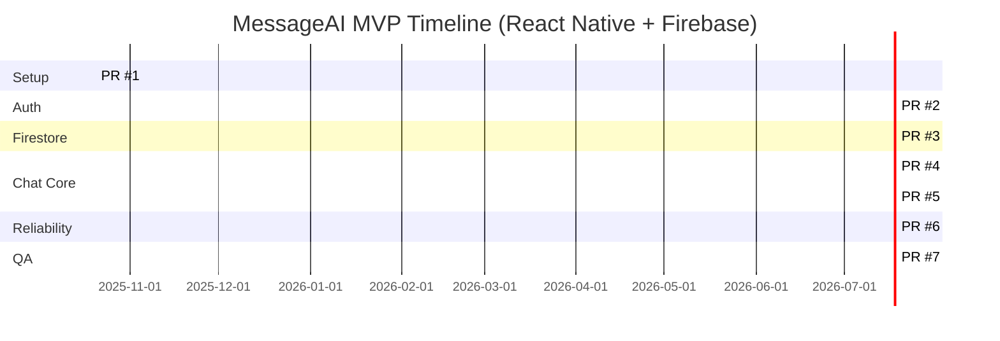

# MessageAI — MVP Implementation Plan (React Native + Firebase)

Each section represents a pull request (PR) in your project repo.

---

## PR #1 — Project Setup & Firebase Initialization
**Goal:** Create a React Native (Expo) app connected to Firebase.
**Tasks:**
- `npx create-expo-app messageai`
- Install Firebase: `npm install firebase`
- Configure Firebase SDK with Auth + Firestore.
- Test connection with a simple `console.log('Firebase connected')`.
**Acceptance Criteria:**
- App runs in Expo iOS simulator.
- Firebase initializes without errors.

---

## PR #2 — Authentication Flow
**Goal:** Implement user registration, login, and persistent sessions.
**Tasks:**
- Create `LoginScreen` and `AuthContext`.
- Use Firebase Auth (email/password).
- Persist auth state with `onAuthStateChanged`.
- Redirect logged-in users to chat screen.
**Acceptance Criteria:**
- User can sign up, log in, and stay signed in across reloads.

---

## PR #3 — Firestore Schema & Message Model
**Goal:** Define and integrate the Firestore structure.
**Tasks:**
- Create Firestore collections: `/chats/{chatId}/messages/{messageId}`.
- Define message model:
  ```json
  {
    "id": "auto-id",
    "senderId": "string",
    "text": "string",
    "timestamp": "serverTimestamp"
  }
  ```
- Implement basic Firestore read/write test.
**Acceptance Criteria:**
- Firestore collections visible in Firebase console.
- Data writes and reads correctly.

---

## PR #4 — Real-Time Chat UI
**Goal:** Enable real-time messaging between users.
**Tasks:**
- Create `ChatScreen` with `FlatList` for messages.
- Add input bar with `TextInput` + send button.
- Implement Firestore listener to sync messages.
- Add optimistic UI update when sending.
**Acceptance Criteria:**
- Two simulators can send/receive messages instantly.

---

## PR #5 — Group Chat Support
**Goal:** Support multiple users in a single thread.
**Tasks:**
- Extend schema to include `members: [userId1, userId2, ...]`.
- Update listener logic to handle multiple participants.
- Display sender name next to messages.
**Acceptance Criteria:**
- 3+ users can see messages in real time.

---

## PR #6 — Offline Support & Reliability
**Goal:** Ensure message persistence when offline.
**Tasks:**
- Enable Firestore persistence: `enableIndexedDbPersistence()`.
- Test sending messages offline → resync on reconnect.
- Add loading/error handling to UI.
**Acceptance Criteria:**
- Messages queue offline and sync once online.
- No data loss on refresh.

---

## PR #7 — UI Polish & QA
**Goal:** Final cleanup and usability improvements.
**Tasks:**
- Style messages (sent vs received colors).
- Add scroll-to-bottom behavior.
- Add message timestamps.
- Conduct manual test checklist for all flows.
**Acceptance Criteria:**
- Smooth UX, all MVP success criteria met.

---

## Definition of Done
- App runs cleanly in Expo iOS simulator.
- Users can log in and chat in real time.
- Firestore syncs offline → online automatically.
- Group chat works.
- MVP demo-ready.

---

## Gantt Diagram


