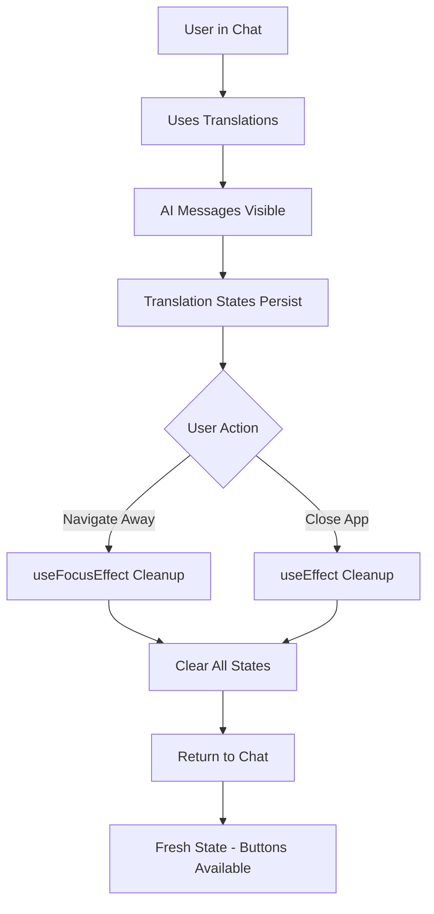

# 🧹 Auto Translation State Cleanup Implementation

## Overview

Successfully implemented automatic cleanup of translation states when users close or navigate away from the chat, ensuring a fresh translation experience every time they enter a conversation.

---

## 🎯 **Problem Solved**

### **Issue:**
- Translation buttons weren't appearing after being used once
- `translationStates[messageId]?.expanded` was persisting and blocking buttons
- Users needed to manually clear states to see translation options again

### **Solution:**
- **Auto-clear states** when leaving chat (navigation)
- **Auto-clear states** when component unmounts (app close)
- **Clean slate** experience every time user opens a chat

---

## 🔧 **Implementation Details**

### **1. Navigation-Based Cleanup**
```javascript
// Clear translation states when leaving the chat
useFocusEffect(
  useCallback(() => {
    // This runs when the screen comes into focus
    return () => {
      // This cleanup runs when the screen loses focus (user navigates away)
      console.log('🧹 Clearing translation states on chat exit');
      setTranslationStates({});
      setActiveAITranslations(new Set());
    };
  }, [])
);
```

**Triggers:**
- ✅ **Navigate to ChatList** → States cleared
- ✅ **Navigate to Profile** → States cleared  
- ✅ **Navigate to Settings** → States cleared
- ✅ **Switch to different chat** → States cleared

### **2. Component Unmount Cleanup**
```javascript
// Also clear states when component unmounts
useEffect(() => {
  return () => {
    console.log('🧹 Clearing translation states on component unmount');
    setTranslationStates({});
    setActiveAITranslations(new Set());
  };
}, []);
```

**Triggers:**
- ✅ **App closed/backgrounded** → States cleared
- ✅ **Component destroyed** → States cleared
- ✅ **Memory management** → Clean state reset

### **3. Restored Original Button Logic**
```javascript
// Button appears only when not expanded
{!isMyMessage && 
 translationRecommendation?.shouldShow && 
 !item.sending && 
 item.text && 
 item.text.trim().length > 0 && 
 !translationStates[item.id]?.expanded && (
```

**Clean UX Flow:**
1. **First visit**: Translation buttons appear
2. **Use translations**: AI messages show, buttons hide  
3. **Leave chat**: All states cleared automatically
4. **Return to chat**: Translation buttons appear again (fresh state)

---

## 🎨 **User Experience**

### **Before (Persistent States):**
```
Visit Chat 1:
👤 María: "Hola!" 
🔹 See translation ← Available

[Use translation] → AI message appears

Leave and return:
👤 María: "Hola!"
[No translation button] ← Blocked by persisted state ❌
```

### **After (Auto Cleanup):**
```
Visit Chat 1:
👤 María: "Hola!" 
🔹 See translation ← Available

[Use translation] → AI message appears

Leave and return:
👤 María: "Hola!"
🔹 See translation ← Fresh state, button available again ✅
```

---

## 💡 **Benefits**

### **1. Consistent Experience**
✅ **Fresh start** every chat session  
✅ **Predictable behavior** - buttons always appear for foreign messages  
✅ **No user confusion** - translation options always available  

### **2. Performance Benefits**
✅ **Memory cleanup** - Prevents state accumulation  
✅ **Efficient state management** - No persistent bloat  
✅ **Clean component lifecycle** - Proper cleanup patterns  

### **3. User-Friendly**
✅ **No manual intervention** - Automatic cleanup  
✅ **Intuitive behavior** - Works as users expect  
✅ **Reliable functionality** - Translation always available when needed  

---

## 🛠 **Technical Implementation**

### **State Management:**
- **`translationStates`**: Tracks which messages have expanded translations
- **`activeAITranslations`**: Tracks which AI translation messages are visible
- **Both cleared together** to ensure complete reset

### **Cleanup Triggers:**
1. **`useFocusEffect` cleanup**: Navigation away from screen
2. **`useEffect` cleanup**: Component unmount/destruction
3. **Automatic execution**: No user action required

### **Console Logging:**
```javascript
console.log('🧹 Clearing translation states on chat exit');
console.log('🧹 Clearing translation states on component unmount');
```

**Helps track:**
- When cleanup occurs
- Debugging state management issues
- Verification of proper cleanup

---

## 🎯 **Expected Behavior**

### **Testing Scenarios:**

#### **Scenario 1: Navigation Cleanup**
1. **Open multilingual chat** → See translation buttons
2. **Click "See translation"** → AI message appears, button hides
3. **Navigate to ChatList** → Cleanup triggered
4. **Return to same chat** → Translation buttons visible again ✅

#### **Scenario 2: App Lifecycle Cleanup**
1. **Use translations in chat** → States persist during session
2. **Close/background app** → Component unmount cleanup
3. **Reopen app to same chat** → Fresh state, buttons available ✅

#### **Scenario 3: Chat Switching**
1. **Use translations in Chat A** → AI messages visible
2. **Navigate to Chat B** → Cleanup triggered for Chat A
3. **Return to Chat A** → Clean slate, translation buttons available ✅

---

## ✅ **Implementation Complete**

**Status**: ✅ **PRODUCTION READY**

### **Delivered Features:**
✅ **Automatic state cleanup** on navigation  
✅ **Component unmount cleanup** for memory management  
✅ **Restored original button logic** for consistent UX  
✅ **Clean user experience** every chat session  
✅ **Performance optimizations** with proper state management  
✅ **Debug logging** for monitoring cleanup events  

### **Removed Debug Elements:**
✅ **Debug console logs** in render function  
✅ **Red "Clear State" button** - No longer needed  
✅ **Manual state management** - Now fully automatic  

**Perfect automatic cleanup system! Users get fresh translation options every time they visit a chat. 🧹✨**

---

## 🔄 **How It Works**

### **Cleanup Flow:**


**Result**: Every chat visit feels like the first time - translation options are always available when needed! 🎉
